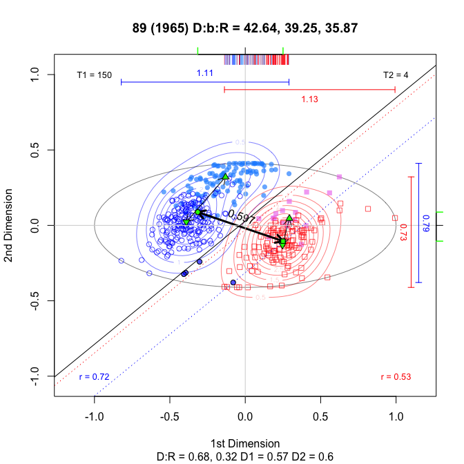

Computing 2D ideological overlap via angle bisection
================
lindbrook
2018-06-20

With this package, you can compute ideological overlap strictly in terms of a single dimension or orthogonally in two dimensions. However I propose a more data driven approach. Using a linear classifier, based the interior bisector of an angle, I create a measure of ideological overlap that allows for possible interaction between dimensions.

The motivation for considering such an approach begins with the fact that when you look at plots of legislators' ideal points in two dimensions across history, you're more likely to see systematic interaction rather than to see one dimensional effects. The clusters of points for Democrats and Republicans, as well as the channel of space that lies between, tend to lies at an oblique angle to both axes. This suggests that, in the absence of compelling theoretic or methodological reasons, computing overlap in one dimension (typically the first) might actually produce misleading results.[1]

Briefly put, I do the following. First, I summarize each party's relationship to the two dimensions by fitting the first principal component through that party's cluster of points.[2]. Second, I then compute the line that bisects the angle formed by the intersection of the two party's principal component lines. This bisector effectively becomes a line of classification that separates Democrats from Republicans. The currency of overlap are "misclassified" legislators: members on the wrong side of the classification line.[3]

[1] Preliminary analysis shows that the degree of ideological overlap using just the first dimension alone is always higher, sometimes greatly higher, than the suggested data driven approach.

[2] I use PCA rather than OLS to avoid giving priority to either dimension.

[3] Preliminary efforts based on logistic regression, linear discriminant analysis, and support vector machines did not produce visually satisfying results.
