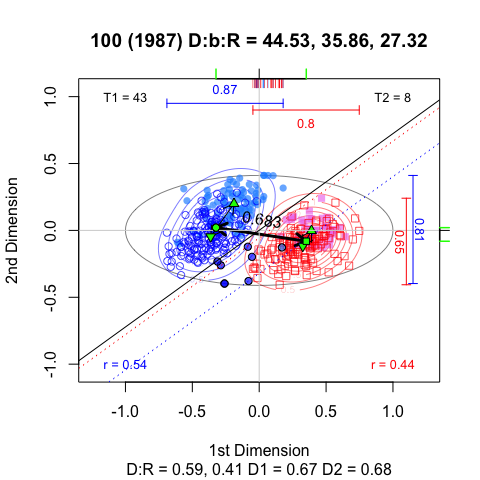
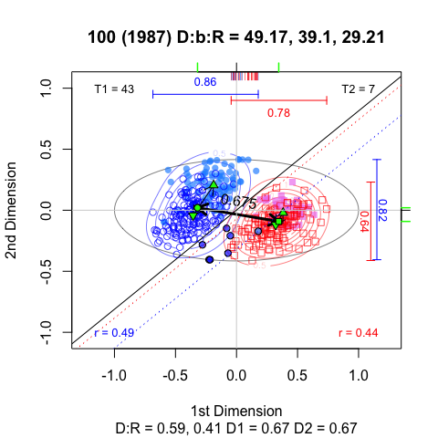
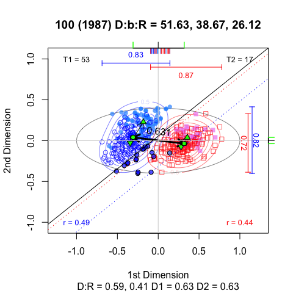

Untitled
================

GitHub Documents
----------------

This is an R Markdown format used for publishing markdown documents to GitHub. When you click the **Knit** button all R code chunks are run and a markdown file (.md) suitable for publishing to GitHub is generated.

Including Code
--------------

<http://voteview.org/page2a.htm>

Common Space DW-NOMINATE Scores 1st to 113th Congresses
-------------------------------------------------------

(<http://voteview.org/dwnomin_joint_house_and_senate.htm>)

Weekly Constant Space DW-NOMINATE Scores
----------------------------------------

(<http://voteview.org/Weekly_Constant_Space_DW-NOMINATE_Scores.htm>)

DW-NOMINATE Scores 1st to 113th Congresses
------------------------------------------

(<http://voteview.org/dwnomin.htm>)

